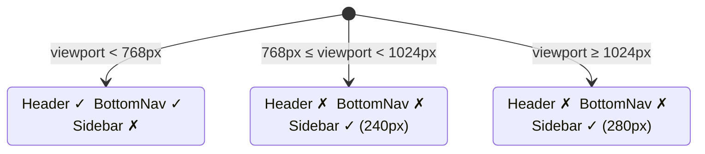
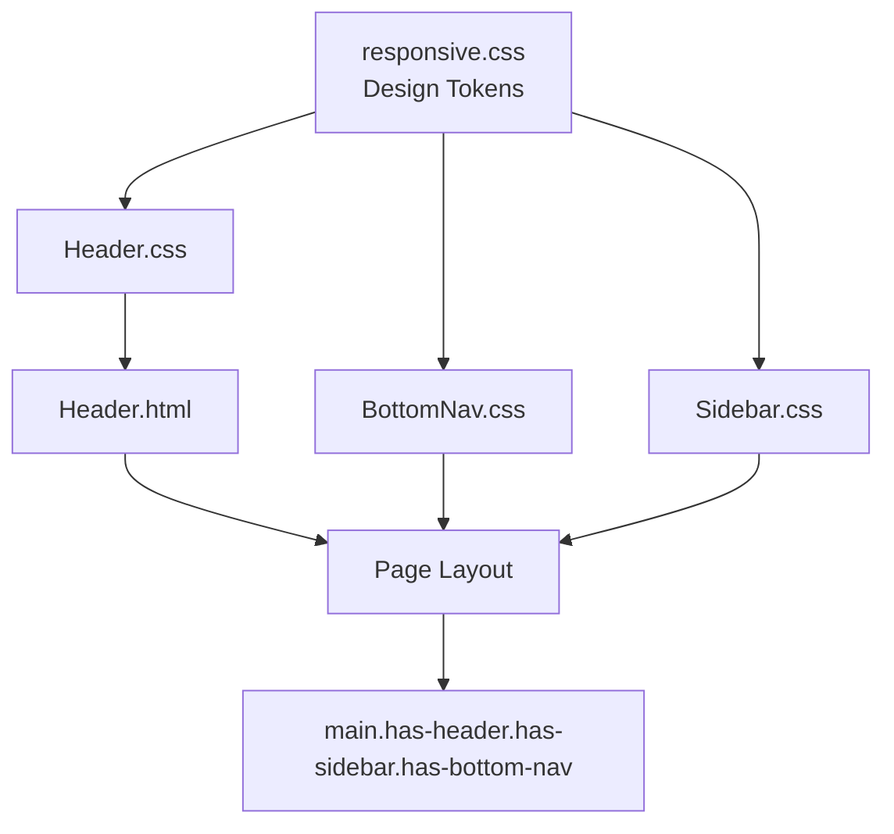

# Design Document: Frontend Header Responsive Styling

## Overview

This document describes the technical design for the `Header` component — a responsive, fixed page-level header for the Stellar Raise frontend. The header renders the brand logo and "Stellar Raise" name on mobile viewports (< 768px) where the `BottomNav` handles primary navigation. On tablet and desktop (≥ 768px), the `Sidebar` already provides brand identity, so the header is hidden to avoid duplication.

The design integrates with the existing responsive design system (`frontend/styles/responsive.css`, `frontend/styles/utilities.css`) and follows the same patterns established by `BottomNav` and `Sidebar`.

### Key Design Decisions

- **Mobile-only visibility**: The header is visible only on viewports < 768px. This mirrors how `BottomNav` hides at ≥ 768px and `Sidebar` appears at ≥ 768px — the two components together cover all breakpoints without overlap.
- **Single source of truth for height**: A `--header-height` custom property (and per-breakpoint variants) is added to `responsive.css` so layout offset calculations never hard-code pixel values.
- **No JavaScript required**: All responsive behavior is achieved with CSS media queries and custom properties, keeping the component purely declarative.
- **Skip-navigation link**: Included as the first focusable child for keyboard/screen-reader users, following WCAG 2.4.1.
This document describes the technical design for the `site-header` component — a responsive, accessible top-of-page navigation bar for the Stellar Raise crowdfunding dApp. The Header fills the navigation gap on mobile viewports (< 768px) where the Sidebar is hidden, and optionally serves as a persistent page-level context bar on all breakpoints.

The design follows the existing mobile-first, BEM-based component architecture established by `BottomNav` and `Sidebar`, reuses all design tokens from `responsive.css`, and is structured to integrate cleanly with the CI/CD pipeline.

### Goals

- Provide a fixed top navigation bar visible on all viewports
- Integrate with BottomNav (mobile) and Sidebar (tablet/desktop) without layout conflicts
- Meet WCAG 2.1 AA accessibility requirements
- Use only existing design system tokens
- Ship with automated touch-target tests and documented manual test cases

---

## Architecture

The header fits into the existing component architecture as a peer of `BottomNav` and `Sidebar`:

```
frontend/
├── styles/
│   └── responsive.css          ← add --header-height-* tokens here
├── components/
│   └── navigation/
│       ├── BottomNav.css / .html   (existing)
│       ├── Sidebar.css / .html     (existing)
│       ├── Header.css              (new)
│       └── Header.html             (new demo page)
└── docs/
    ├── RESPONSIVE_DESIGN_GUIDE.md  (update)
    └── TESTING_GUIDE.md            (update)
```

### Breakpoint Behavior

```
< 768px   (mobile)   → Header visible, BottomNav visible, Sidebar hidden
≥ 768px   (tablet)   → Header hidden, Sidebar visible, BottomNav hidden
≥ 1024px  (desktop)  → Header hidden, Sidebar visible (wider), BottomNav hidden
```



### Layout Offset Model

On mobile, the main content area must be offset for both the fixed header (top) and the fixed bottom nav (bottom):

```
┌─────────────────────────────────┐
│  Header (fixed, top)            │  ← --header-height-mobile (48–64px)
├─────────────────────────────────┤
│                                 │
│  Main content                   │  ← padding-top: var(--header-height)
│                                 │       + safe-area-inset-top
│                                 │  ← padding-bottom: 72px
│                                 │       + safe-area-inset-bottom
├─────────────────────────────────┤
│  BottomNav (fixed, bottom)      │  ← 72px
└─────────────────────────────────┘
The Header is a standalone CSS + HTML component that slots into the existing frontend component library. It has no JavaScript runtime dependency — all responsive behavior is handled via CSS media queries and design tokens.



### Layout Coordination

The three navigation components share the viewport without overlap through CSS custom properties and layout offset classes:

```
Mobile (< 768px):
┌─────────────────────────────┐  ← site-header (fixed top, --header-height)
│         Header              │
├─────────────────────────────┤
│                             │
│    main.has-header          │  ← padding-top: var(--header-height)
│         .has-bottom-nav     │  ← padding-bottom: ~72px
│                             │
├─────────────────────────────┤
│       BottomNav             │  ← fixed bottom
└─────────────────────────────┘

Tablet/Desktop (≥ 768px):
┌──────────┬──────────────────┐
│          │     Header       │  ← fixed top, offset right of sidebar
│ Sidebar  ├──────────────────┤
│ (240px)  │                  │
│          │  main.has-header │
│          │     .has-sidebar │
└──────────┴──────────────────┘
```

---

## Components and Interfaces

### Header HTML Structure

```html
<header class="site-header" role="banner">
  <!-- Skip navigation (first focusable child) -->
  <a href="#main-content" class="site-header__skip-link">Skip to main content</a>

  <div class="site-header__inner">
    <!-- Brand identity -->
    <div class="site-header__brand">
      <svg class="site-header__logo" width="32" height="32" viewBox="0 0 32 32"
           fill="none" aria-hidden="true">
        <circle cx="16" cy="16" r="16" fill="var(--color-primary-blue)"/>
        <path d="M16 8L20 16L16 24L12 16L16 8Z" fill="white"/>
      </svg>
      <span class="site-header__brand-name">Stellar Raise</span>
    </div>

    <!-- Optional contextual actions slot -->
    <div class="site-header__actions">
      <!-- e.g. wallet connect button -->
    </div>
  </div>
</header>
```

### CSS Class API

| Class | Purpose |
|---|---|
| `.site-header` | Root element — fixed positioning, height, background, shadow |
| `.site-header__skip-link` | Visually hidden skip link, visible on focus |
| `.site-header__inner` | Flex row container for brand + actions |
| `.site-header__brand` | Flex row: logo + brand name |
| `.site-header__logo` | SVG logo mark |
| `.site-header__brand-name` | "Stellar Raise" text |
| `.site-header__actions` | Right-aligned slot for contextual actions |
| `.has-header` | Applied to `<main>` — adds `padding-top` equal to header height |

### Design Token Interface

The following tokens are consumed by `Header.css` (all defined in `responsive.css`):

| Token | Usage |
|---|---|
| `--header-height-mobile` | Height at < 768px (48px) |
| `--header-height-tablet` | Height at 768–1023px (56px) |
| `--header-height-desktop` | Height at ≥ 1024px (64px) |
| `--header-height` | Alias set per breakpoint for layout offsets |
| `--color-neutral-100` | Header background |
| `--color-deep-navy` | Brand name text color |
| `--color-primary-blue` | Focus indicator, logo fill |
| `--font-family-primary` | All header text |
| `--font-size-lg` | Brand name font size |
| `--shadow-sm` | Resting shadow |
| `--shadow-md` | Scrolled shadow |
| `--transition-fast` | Shadow transition on scroll |
| `--z-fixed` | z-index (same layer as BottomNav/Sidebar) |
| `--safe-area-inset-top` | Top padding for notched devices |
| `--space-4` | Horizontal padding |
| `--touch-target-min` | Minimum 44px for interactive elements |
### File Structure

```
frontend/components/header/
├── Header.html          # Component markup
├── Header.css           # Component styles
├── Header.test.html     # Manual browser test cases
└── header.test.js       # Automated touch-target test script
```

### Header.html

The `<header>` element uses BEM block class `site-header` and contains three child regions in a single flex row:

| Region | BEM Element | Content |
|--------|-------------|---------|
| Left | `site-header__logo` | Logo SVG + brand name |
| Center | `site-header__title` | Page title slot (optional) |
| Right | `site-header__actions` | Icon buttons, notification badge |

Key structural requirements:
- `role="banner"` on the `<header>` element
- `aria-label="Site header"` on the `<header>` element
- Skip-navigation link as the first focusable child: `<a href="#main-content" class="site-header__skip-link">`
- All decorative SVGs carry `aria-hidden="true"`
- Icon-only buttons carry descriptive `aria-label` attributes
- Notification badge carries `aria-label="N new notifications"`

### Header.css

The stylesheet is organized in the following sections (matching the pattern in `BottomNav.css` and `Sidebar.css`):

1. Block: `.site-header` — fixed positioning, z-index, background, border, safe-area padding
2. Elements: `__skip-link`, `__logo`, `__brand`, `__title`, `__actions`, `__icon-btn`, `__badge`
3. Modifier: `__icon-btn--active`
4. Responsive overrides: `@media (min-width: 768px)` and `@media (min-width: 1024px)`
5. Layout offset: `.has-header` applied to `<main>`
6. Reduced motion: `@media (prefers-reduced-motion: reduce)`

### CSS Custom Property: `--header-height`

Defined on `.site-header` and consumed by `.has-header`:

```css
.site-header {
  --header-height: 56px;
}

@media (min-width: 768px) {
  .site-header {
    --header-height: 64px;
  }
}

.has-header {
  padding-top: var(--header-height);
}
```

This allows other components (e.g., sticky sub-headers, scroll-offset anchors) to reference `--header-height` without hardcoding values.

### header.test.js

A vanilla JS script (no framework dependency) that:
1. Queries all interactive elements within `.site-header`
2. Measures their `getBoundingClientRect()` dimensions
3. Asserts `width >= 44` and `height >= 44`
4. Logs pass/fail results to the console with element references

This mirrors the pattern documented in `frontend/docs/TESTING_GUIDE.md`.

---

## Data Models

The header is a purely presentational CSS/HTML component with no runtime data model. The relevant "data" is the set of CSS custom properties that parameterize its appearance.

### New CSS Custom Properties (added to `responsive.css`)

```css
:root {
  /* Header height tokens */
  --header-height-mobile:  48px;
  --header-height-tablet:  56px;
  --header-height-desktop: 64px;

  /* Alias — updated per breakpoint via media queries */
  --header-height: var(--header-height-mobile);
}

@media (min-width: 768px) {
  :root {
    --header-height: var(--header-height-tablet);
  }
}

@media (min-width: 1024px) {
  :root {
    --header-height: var(--header-height-desktop);
  }
}
```

### Layout Offset Classes (added to `responsive.css` or `Header.css`)

```css
/* Applied to <main> when header is present */
.has-header {
  padding-top: calc(var(--header-height) + var(--safe-area-inset-top));
}

/* On tablet+, header is hidden so offset is removed */
@media (min-width: 768px) {
  .has-header {
    padding-top: 0;
  }
}
```

### Scroll State (JavaScript-assisted, optional)

The shadow elevation change on scroll (Requirement 3.4) can be driven by a small inline script or a CSS scroll-driven animation. The recommended approach is a single `scroll` event listener that toggles a `.site-header--scrolled` class on the `<header>` element:

```js
// Minimal scroll shadow toggle
const header = document.querySelector('.site-header');
window.addEventListener('scroll', () => {
  header.classList.toggle('site-header--scrolled', window.scrollY > 0);
}, { passive: true });
```

```css
.site-header {
  box-shadow: var(--shadow-sm);
  transition: box-shadow var(--transition-fast);
}
.site-header--scrolled {
  box-shadow: var(--shadow-md);
}
```
The Header is a pure presentational component with no runtime data model. Its configurable slots are expressed as HTML attributes and content:

| Slot | Mechanism | Example |
|------|-----------|---------|
| Brand name | Text content of `.site-header__brand` | `"Stellar Raise"` |
| Page title | Text content of `.site-header__title` | `"Dashboard"` |
| Action buttons | Child elements of `.site-header__actions` | Icon buttons |
| Notification count | `aria-label` + text of `.site-header__badge` | `"3"` |
| Active state | Modifier class on icon button | `site-header__icon-btn--active` |

### Design Token Dependencies

All values consumed from `responsive.css`:

| Token | Usage |
|-------|-------|
| `--color-neutral-100` | Header background |
| `--color-neutral-300` | Bottom border |
| `--color-neutral-700` | Default icon/text color |
| `--color-deep-navy` | Brand name text |
| `--color-primary-blue` | Active state, focus ring |
| `--color-error-red` | Notification badge background |
| `--space-2`, `--space-3`, `--space-4` | Padding and gaps |
| `--font-size-sm`, `--font-size-lg` | Label and brand typography |
| `--font-size-xs` | Badge typography |
| `--z-fixed` | Z-index layering |
| `--transition-fast` | Hover/focus transitions |
| `--radius-md`, `--radius-full` | Border radii |
| `--touch-target-min` | 44px minimum interactive size |
| `--safe-area-inset-top/left/right` | Notch/cutout padding |

No new global tokens are required. If a local value is needed (e.g., `--header-height`), it is scoped to the `.site-header` block.

---

## Correctness Properties

*A property is a characteristic or behavior that should hold true across all valid executions of a system — essentially, a formal statement about what the system should do. Properties serve as the bridge between human-readable specifications and machine-verifiable correctness guarantees.*

### Property 1: Header height is within spec at every breakpoint

*For any* rendered viewport width, the computed height of `.site-header` should fall within the range specified for that breakpoint: [48px, 64px] for mobile (< 768px), [56px, 72px] for tablet (768–1023px), and [64px, 80px] for desktop (≥ 1024px).

**Validates: Requirements 1.2, 1.3, 1.4**

---

### Property 2: Header visibility is mutually exclusive with Sidebar

*For any* viewport width ≥ 768px, `.site-header` should have `display: none` (or equivalent computed style that removes it from layout), and `.sidebar` should be visible. *For any* viewport width < 768px, `.site-header` should be visible and `.sidebar` should not be rendered.

**Validates: Requirements 1.3, 1.4, 2.2**

---

### Property 3: Main content is never obscured by fixed navigation

*For any* viewport width < 768px, the `padding-top` of the main content area should be greater than or equal to the computed height of `.site-header`, and the `padding-bottom` should be greater than or equal to 72px (the BottomNav height). This ensures no content is hidden behind either fixed element.

**Validates: Requirements 2.1, 2.4**

---

### Property 4: Design token exclusivity

*For any* CSS rule in `Header.css`, every color, spacing, font, shadow, and z-index value should reference a CSS custom property (i.e., use `var(--...)`) rather than a hard-coded literal. The linter should report a violation for any hard-coded value that has a design system equivalent.

**Validates: Requirements 3.1, 3.2, 3.3, 3.4, 3.5, 3.6**

---

### Property 5: Touch target compliance for all interactive elements

*For any* interactive element (link, button) within `.site-header`, its computed `min-height` and `min-width` should both be ≥ 44px.
### Property 1: Touch target minimum size

*For any* interactive element rendered inside `.site-header` (links, buttons, icon buttons), its rendered bounding rectangle SHALL have both width and height greater than or equal to 44px.

**Validates: Requirements 4.1, 4.2**

---

### Property 2: Touch target spacing

*For any* two adjacent interactive elements inside `.site-header`, the gap between their bounding rectangles SHALL be at least 8px.

**Validates: Requirements 4.3**

---

### Property 6: Focus indicator present on all interactive elements

*For any* interactive element within `.site-header` that receives keyboard focus, the element should display a visible focus indicator with `outline: 2px solid var(--color-primary-blue)` and `outline-offset: 2px`.

**Validates: Requirements 4.5**

---

### Property 7: Reduced-motion transitions are suppressed

*For any* animated property in `.site-header`, when `prefers-reduced-motion: reduce` is active, the transition duration should be ≤ 0.01ms.

**Validates: Requirements 4.6**

---

### Property 8: Skip link is the first focusable element

*For any* rendered Header, the first element reached by pressing Tab from outside the header should be the skip-navigation link, and activating it should move focus to `#main-content`.

**Validates: Requirements 4.2**
### Property 3: Design token exclusivity

*For any* CSS declaration in `Header.css`, color values SHALL reference `var(--color-*)` tokens, spacing values SHALL reference `var(--space-*)` tokens, font-size values SHALL reference `var(--font-size-*)` tokens, and transition values SHALL reference `var(--transition-fast)` or `var(--transition-base)` — with no hardcoded hex, rgb, hsl, pixel, or rem literals outside of safe-area `calc()` expressions.

**Validates: Requirements 7.1, 7.2, 7.3, 7.4**

---

### Property 4: Safe-area padding correctness

*For any* value of `env(safe-area-inset-top)` (including zero), the Header's computed `padding-top` SHALL equal `var(--space-2)` plus the inset value. Similarly, computed `padding-left` SHALL equal `var(--space-4)` plus `env(safe-area-inset-left)`, and `padding-right` SHALL equal `var(--space-4)` plus `env(safe-area-inset-right)`.

**Validates: Requirements 3.1, 3.2, 3.3**

---

### Property 5: Layout offset correctness

*For any* viewport width and any page where `.has-header` is applied to `<main>`, the main element's computed `padding-top` SHALL equal the Header's `--header-height` value, and on mobile viewports the main element's `padding-bottom` SHALL account for the BottomNav height, ensuring no content is obscured by either fixed navigation bar.

**Validates: Requirements 9.1, 9.4**

---

### Property 6: Reduced motion suppression

*For any* user agent where `prefers-reduced-motion: reduce` is active, all CSS `transition-duration` and `animation-duration` values within the Header SHALL resolve to 0.01ms or less.

**Validates: Requirements 6.1, 6.2**

---

### Property 7: Notification badge accessibility label

*For any* notification count N rendered in a `.site-header__badge` element, the badge's `aria-label` attribute SHALL contain the string representation of N and the word "notifications".

**Validates: Requirements 5.5**

---

### Property 8: Header visibility and positioning across breakpoints

*For any* viewport width less than 768px, the Header SHALL have `position: fixed`, `top: 0`, and `display` not equal to `none`. *For any* viewport width of 768px or greater, the Header SHALL remain visible and its left edge SHALL be offset by at least the Sidebar width (240px on tablet, 280px on desktop), preventing overlap.

**Validates: Requirements 2.1, 2.2, 9.2**

---

### Property 9: Focus indicator on interactive elements

*For any* interactive element inside `.site-header` that receives keyboard focus, the computed `outline` SHALL be `2px solid var(--color-primary-blue)` and `outline-offset` SHALL be `2px`.

**Validates: Requirements 5.2**

---

### Property 10: Decorative SVG aria-hidden

*For any* SVG element inside `.site-header` that is purely decorative (not conveying unique information), the element SHALL carry `aria-hidden="true"`.

**Validates: Requirements 5.3**

---

### Property 11: Icon-only button aria-label

*For any* button inside `.site-header` whose visible content consists solely of an SVG icon (no visible text), the button SHALL carry a non-empty `aria-label` attribute describing its action.

**Validates: Requirements 5.4**

---

### Property 12: No duplicate CSS selectors

*For any* two selector blocks in `Header.css`, the selector strings SHALL be distinct — no selector SHALL appear more than once in the stylesheet.

**Validates: Requirements 8.3**

---

## Error Handling

### Missing Design Tokens

If a CSS custom property referenced by `Header.css` is not defined (e.g., `responsive.css` is not loaded), the browser falls back to the initial value for that property. To mitigate:
- `Header.html` explicitly links both `../../styles/responsive.css` and `Header.css` in the correct order.
- The CI lint step validates that all `var(--...)` references in `Header.css` are declared in `responsive.css`.

### Safe Area Insets Not Supported

On browsers that do not support `env(safe-area-inset-top)`, the expression `calc(var(--space-4) + env(safe-area-inset-top, 0))` falls back to `var(--space-4)` (16px) via the fallback argument, which is acceptable.

### Snapshot Test Baseline Missing

On first run, the CI snapshot step will create baseline images rather than diff against them. The pipeline should be configured to commit these baselines and only fail on subsequent runs when a diff exceeds 0.1%.

### Sidebar/Header Both Visible (Edge Case)

If a developer accidentally applies both `.has-header` and `.has-sidebar` to the same `<main>` element, the header's `padding-top` and the sidebar's `margin-left` will both apply. This is not harmful but is redundant on tablet/desktop. Documentation should note that `.has-header` is only meaningful on mobile viewports.
Since the Header is a static HTML/CSS component with no runtime logic, error handling focuses on graceful degradation:

| Scenario | Behavior |
|----------|----------|
| `env(safe-area-inset-top)` unsupported | `calc()` falls back to `var(--space-2)` via the `, 0` default in the env() call |
| Missing `--header-height` consumer | `.has-header` padding-top defaults to the token value; no layout break |
| Badge element absent | No badge rendered; no ARIA error since element is simply absent |
| Icon-only button missing `aria-label` | Caught by automated accessibility audit (axe/Lighthouse) in CI |
| Font load failure | System font stack fallback defined in `--font-family-primary` |
| CSS custom property not defined | Browser uses initial value; flagged by CSS linting in CI |

---

## Testing Strategy

### Dual Testing Approach

Both unit/example tests and property-based tests are required. Unit tests cover specific examples and edge cases; property tests verify universal invariants across generated inputs.

### Unit / Example Tests

These are manual or automated browser-based checks at specific viewports:

- **Breakpoint rendering**: Load `Header.html` at 375px, 768px, and 1280px; assert header visibility, height, and shadow state.
- **Skip link**: Tab to the skip link, press Enter, assert `document.activeElement` is `#main-content`.
- **Scroll shadow**: Scroll page to `scrollY = 1`; assert `.site-header--scrolled` class is present and `box-shadow` equals `var(--shadow-md)`.
- **Safe area**: Simulate `env(safe-area-inset-top) = 44px`; assert header `padding-top` is `44px`.
- **Sidebar co-existence**: At 768px, assert `.site-header` is not in the layout flow and `.sidebar` is visible.
- **Accessibility audit**: Run axe-core against `Header.html` at 375px, 768px, 1280px; assert zero violations.

### Property-Based Tests

Property-based tests use a PBT library appropriate for the target language. Since this is a CSS/HTML component, tests are written in JavaScript using **fast-check** (a TypeScript/JavaScript PBT library) combined with a headless browser (Playwright or jsdom with CSS support).

Each property test runs a minimum of **100 iterations** with randomly generated inputs (viewport widths, scroll positions, content lengths).

**Tag format**: `Feature: frontend-header-responsive-styling, Property {N}: {property_text}`

#### Property Test Specifications

**Property 1 — Header height within spec**
```
// Feature: frontend-header-responsive-styling, Property 1: Header height is within spec at every breakpoint
// For any viewport width, assert computed header height is within the breakpoint range.
fc.property(
  fc.integer({ min: 320, max: 1920 }),  // random viewport width
  (width) => {
    setViewportWidth(width);
    const height = getComputedHeight('.site-header');
    if (width < 768)  return height >= 48 && height <= 64;
    if (width < 1024) return height >= 56 && height <= 72;
    return height >= 64 && height <= 80;
  }
)
```

**Property 2 — Header/Sidebar mutual exclusivity**
```
// Feature: frontend-header-responsive-styling, Property 2: Header visibility is mutually exclusive with Sidebar
fc.property(
  fc.integer({ min: 320, max: 1920 }),
  (width) => {
    setViewportWidth(width);
    const headerVisible = isVisible('.site-header');
    const sidebarVisible = isVisible('.sidebar');
    return headerVisible !== sidebarVisible; // exactly one is visible
  }
)
```

**Property 3 — Content not obscured**
```
// Feature: frontend-header-responsive-styling, Property 3: Main content is never obscured by fixed navigation
fc.property(
  fc.integer({ min: 320, max: 767 }),  // mobile only
  (width) => {
    setViewportWidth(width);
    const paddingTop = getComputedPaddingTop('main.has-header');
    const paddingBottom = getComputedPaddingBottom('main.has-header');
    const headerHeight = getComputedHeight('.site-header');
    return paddingTop >= headerHeight && paddingBottom >= 72;
  }
)
```

**Property 5 — Touch target compliance**
```
// Feature: frontend-header-responsive-styling, Property 5: Touch target compliance for all interactive elements
fc.property(
  fc.constantFrom(375, 390, 430),  // representative mobile widths
  (width) => {
    setViewportWidth(width);
    const interactives = queryAll('.site-header a, .site-header button');
    return interactives.every(el => {
      const rect = el.getBoundingClientRect();
      return rect.width >= 44 && rect.height >= 44;
    });
  }
)
```

**Property 6 — Focus indicator present**
```
// Feature: frontend-header-responsive-styling, Property 6: Focus indicator present on all interactive elements
fc.property(
  fc.constantFrom(375, 768, 1280),
  (width) => {
    setViewportWidth(width);
    const interactives = queryAll('.site-header a, .site-header button');
    return interactives.every(el => {
      el.focus();
      const style = getComputedStyle(el);
      return style.outlineWidth === '2px' && style.outlineColor.includes('0, 102, 255');
    });
  }
)
```

**Property 7 — Reduced-motion suppression**
```
// Feature: frontend-header-responsive-styling, Property 7: Reduced-motion transitions are suppressed
// Simulate prefers-reduced-motion: reduce, then assert all transition durations ≤ 0.01ms
fc.property(
  fc.integer({ min: 320, max: 1920 }),
  (width) => {
    setViewportWidth(width);
    setMediaFeature('prefers-reduced-motion', 'reduce');
    const header = query('.site-header');
    const duration = parseFloat(getComputedStyle(header).transitionDuration) * 1000;
    return duration <= 0.01;
  }
)
```

**Property 8 — Skip link is first focusable**
```
// Feature: frontend-header-responsive-styling, Property 8: Skip link is the first focusable element
// Example test (single specific case, not randomized)
const firstFocusable = getFirstFocusableInHeader();
assert(firstFocusable.matches('.site-header__skip-link'));
activateLink(firstFocusable);
assert(document.activeElement.id === 'main-content');
```

### CI/CD Integration

The following steps are added to the CI pipeline (`.github/`):

1. **CSS lint** — validate `frontend/components/navigation/Header.css` and `frontend/styles/responsive.css` against project lint rules; fail on hard-coded values with design token equivalents.
2. **HTML validation** — validate `frontend/components/navigation/Header.html` for well-formed markup.
3. **Accessibility audit** — run axe-core against `Header.html` at 375px, 768px, 1280px; fail on any WCAG 2.1 AA violation.
4. **Snapshot tests** — capture screenshots at 375px, 768px, 1280px; fail if pixel diff > 0.1%.
5. **Property tests** — run fast-check property suite; minimum 100 iterations per property.

All steps must pass before a pull request can be merged.
Both unit/example tests and property-based tests are required for comprehensive coverage.

**Unit / example tests** (`Header.test.html`) cover:
- Visual rendering at 375px, 768px, 1280px viewports
- Skip-link visibility and focus behavior
- Active state indicator rendering
- Badge display with and without count
- Sidebar co-existence at tablet/desktop breakpoints
- BottomNav co-existence at mobile breakpoint
- Reduced motion: verify transitions are suppressed
- Keyboard tab order through all interactive elements

**Automated script tests** (`header.test.js`) cover:
- Touch target size assertion for all interactive elements (Property 1)
- Touch target spacing assertion between adjacent elements (Property 2)

### Property-Based Testing

The property-based tests are implemented using **fast-check** (JavaScript), which generates random inputs to validate universal properties.

Each test runs a minimum of **100 iterations**.

Tag format: `Feature: frontend-header-responsive-styling, Property N: <property_text>`

| Property | Test Approach | fast-check Strategy |
|----------|---------------|---------------------|
| P1: Touch target size | Generate random viewport widths in [320, 1920]; render header; measure all interactive elements | `fc.integer({ min: 320, max: 1920 })` |
| P2: Touch target spacing | Generate random sets of adjacent button pairs; measure gaps | `fc.array(fc.record({...}))` |
| P3: Token exclusivity | Parse `Header.css` AST; for each declaration check value against allowed patterns | `fc.constantFrom(...cssDeclarations)` |
| P4: Safe-area padding | Generate random inset values including 0; verify computed padding = space token + inset | `fc.nat({ max: 60 })` mapped to env mock |
| P5: Layout offset | Generate random `--header-height` values; verify `.has-header` padding-top matches | `fc.integer({ min: 40, max: 120 })` |
| P6: Reduced motion | Toggle `prefers-reduced-motion`; verify all transition/animation durations ≤ 0.01ms | `fc.boolean()` for media query state |
| P7: Badge aria-label | Generate random notification counts [0, 999]; verify aria-label contains count + "notifications" | `fc.integer({ min: 0, max: 999 })` |
| P8: Visibility & positioning | Generate random viewport widths across mobile/tablet/desktop ranges; verify position and offset | `fc.integer({ min: 320, max: 1920 })` |
| P9: Focus indicator | Enumerate all interactive elements; programmatically focus each; verify computed outline | `fc.constantFrom(...interactiveElements)` |
| P10: SVG aria-hidden | Enumerate all SVG elements; verify aria-hidden="true" on decorative ones | `fc.constantFrom(...svgElements)` |
| P11: Icon-only button aria-label | Enumerate all icon-only buttons; verify non-empty aria-label | `fc.constantFrom(...iconButtons)` |
| P12: No duplicate selectors | Parse all selector strings from Header.css; verify uniqueness | `fc.constantFrom(...selectors)` |

### CI/CD Integration

The following checks run on every pull request:

1. **HTML validation** — W3C validator rules via `html-validate` CLI
2. **CSS linting** — `stylelint` with no-duplicate-selectors rule; no hardcoded color/spacing values
3. **Touch target script** — `node header.test.js` exits non-zero on any failing assertion
4. **Accessibility audit** — `axe-core` CLI or Lighthouse CI checks ARIA labels, focus indicators, contrast
5. **Visual regression** (optional) — Percy or BackstopJS snapshot at 375px, 768px, 1280px

### Accessibility Verification Checklist

- [ ] Skip link is the first focusable element and becomes visible on focus
- [ ] All interactive elements reachable via Tab in left-to-right order
- [ ] Focus indicator: `outline: 2px solid var(--color-primary-blue); outline-offset: 2px`
- [ ] All decorative SVGs have `aria-hidden="true"`
- [ ] All icon-only buttons have descriptive `aria-label`
- [ ] Notification badge `aria-label` includes count and context
- [ ] `role="banner"` present on `<header>`
- [ ] Color contrast ≥ 4.5:1 for all text
