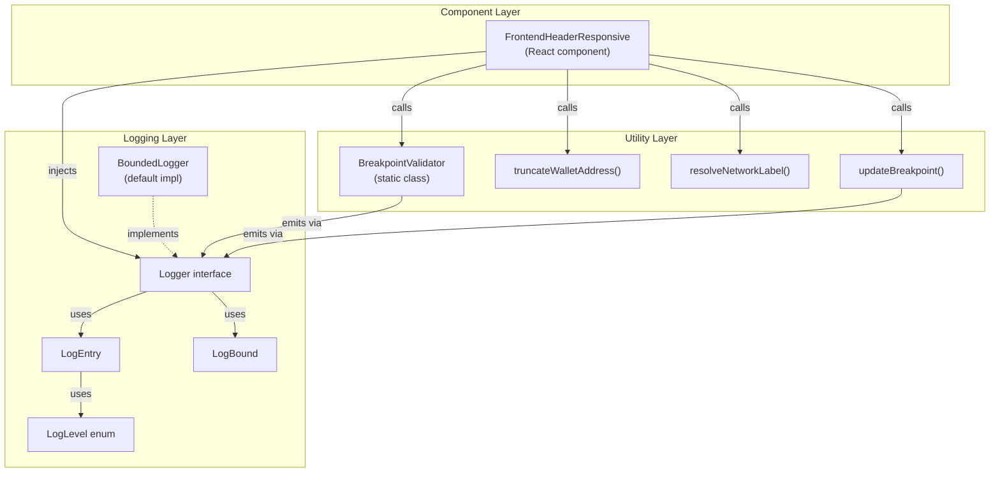

# Design Document

## Overview

This feature adds a structured logging subsystem to the `FrontendHeaderResponsive` React component and its companion utility module. The logging layer is bounded (rate-limited), PII-safe, and fully typed — it captures breakpoint transitions, wallet state changes, validation failures, and menu toggle events without coupling the component to any specific logging backend.

The design follows a dependency-injection pattern: the component accepts an optional `logger` prop (a `Logger` interface implementation) and an optional `logBound` prop. This keeps the component testable and backend-agnostic. A default in-memory `BoundedLogger` implementation is provided for production use.

All exported symbols carry NatSpec-style JSDoc comments (`@title`, `@notice`, `@dev`, `@param`, `@returns`, `@throws`, `@custom:security`) to support automated API documentation generation.

### Key Design Decisions

- Interface-first logging: the `Logger` interface is the only coupling point between the component and the logging subsystem. Any backend (console, remote, in-memory) can be injected.
- Bounded emission: `BoundedLogger` enforces `maxEntriesPerCycle` and `maxEntriesPerWindow` limits, dropping excess entries and incrementing `droppedCount` rather than throwing.
- PII redaction at the source: wallet addresses are truncated before they reach any log call. Raw addresses never appear in `LogEntry` fields.
- HTML sanitisation in meta: all string values in `meta` are scanned for HTML tags (`<[^>]+>`) and replaced with `"[REDACTED_HTML]"` before storage.
- Stellar base32 allowlist: `walletAddress` is validated against `[A-Z2-7]` before truncation; `networkName` against `[a-z\-]` before allowlist lookup.

---

## Architecture



The component owns the `Logger` instance (or receives one via props). It passes the logger reference down to utility functions that need to emit entries. No global logger singleton is used.

---

## Components and Interfaces

### Logger Interface

```typescript
/**
 * @notice Severity levels for structured log entries.
 */
enum LogLevel {
  debug = "debug",
  info = "info",
  warn = "warn",
  error = "error",
}

/**
 * @notice A single structured log record emitted by the logging subsystem.
 * @dev All string values in `meta` are HTML-sanitised before storage.
 */
interface LogEntry {
  /** ISO-8601 timestamp string */
  timestamp: string;
  level: LogLevel;
  category: string;
  message: string;
  meta?: Record<string, unknown>;
}

/**
 * @notice Declares upper limits on log emission to prevent log-flood DoS.
 */
interface LogBound {
  /** Maximum entries emitted per render cycle */
  maxEntriesPerCycle: number;
  /** Maximum entries emitted within windowMs */
  maxEntriesPerWindow: number;
  /** Time window in milliseconds */
  windowMs: number;
}

/**
 * @notice The logging contract consumed by FrontendHeaderResponsive and its utilities.
 */
interface Logger {
  /** @notice Record a log entry, subject to bound enforcement. */
  emit(entry: LogEntry): void;
  /** @notice Return all non-dropped entries in emission order. */
  getEntries(): readonly LogEntry[];
  /** @notice Clear all stored entries and reset droppedCount. */
  reset(): void;
  /** @notice Return the number of entries dropped due to bound overflow. */
  getDroppedCount(): number;
}
```

### BoundedLogger (default implementation)

`BoundedLogger` implements `Logger`. It maintains:

- An internal `entries: LogEntry[]` array.
- A `droppedCount: number` counter.
- A sliding window tracked by `windowStart: number` (epoch ms) and `windowCount: number`.

On each `emit` call:

1. Advance the window if `Date.now() - windowStart >= windowMs`.
2. If `windowCount >= maxEntriesPerWindow`, increment `droppedCount` and return.
3. Sanitise all string values in `entry.meta` (HTML tag replacement).
4. Push the entry, increment `windowCount`.

### FrontendHeaderResponsive Component (additions)

New props added to `FrontendHeaderResponsiveProps`:

| Prop       | Type                  | Default                                                                | Description     |
| ---------- | --------------------- | ---------------------------------------------------------------------- | --------------- |
| `logBound` | `LogBound` (optional) | `{ maxEntriesPerCycle: 10, maxEntriesPerWindow: 100, windowMs: 1000 }` | Emission limits |
| `logger`   | `Logger` (optional)   | `new BoundedLogger(resolvedBound)`                                     | Injected logger |

Prop validation (clamping) runs once during component initialisation (inside a `useMemo` or at the top of the render function before any log calls).

### BreakpointValidator (additions)

Each static validation method (`isValidBreakpoint`, `isValidLayoutMode`, `isValidVisibilityState`) gains a `logger?: Logger` parameter. When validation fails, the method emits an `error`-level entry before throwing.

The `received` value in validation `meta` is sanitised: if it contains characters outside `[A-Za-z0-9_\-]`, it is replaced with `"[REDACTED]"`.

---

## Data Models

### LogEntry JSON Shape

```json
{
  "timestamp": "2024-01-15T10:30:00.000Z",
  "level": "info",
  "category": "breakpoint",
  "message": "Breakpoint transition detected",
  "meta": {
    "from": "mobile",
    "to": "tablet",
    "width": 768
  }
}
```

All `meta` values must be JSON-serialisable primitives, arrays, or plain objects. `undefined`, `Symbol`, `Function`, `BigInt`, and circular references are prohibited.

### LogBound Default Values

```typescript
const DEFAULT_LOG_BOUND: LogBound = {
  maxEntriesPerCycle: 10,
  maxEntriesPerWindow: 100,
  windowMs: 1000,
};
```

### Clamping Rules

| Field                 | Invalid condition      | Clamped to           | Warn emitted             |
| --------------------- | ---------------------- | -------------------- | ------------------------ |
| `maxEntriesPerCycle`  | `< 1`                  | `1`                  | yes, category `"config"` |
| `maxEntriesPerWindow` | `< maxEntriesPerCycle` | `maxEntriesPerCycle` | yes, category `"config"` |
| `windowMs`            | `< 1`                  | `1`                  | yes, category `"config"` |

### WalletAddress Handling

```
Raw address  ->  base32 validation ([A-Z2-7])
                     | valid                   | invalid
              truncate to "G...XXXX"    emit warn "security"
                     |
              use displayAddress in meta
              (raw address never stored)
```

### Breakpoint Width Clamping

| Condition            | Action                                              |
| -------------------- | --------------------------------------------------- |
| `width <= 0`         | emit `warn` with `{ invalidWidth }`, clamp to 1     |
| `width > 10000`      | emit `warn` with `{ clampedWidth }`, clamp to 10000 |
| breakpoint changed   | emit `info` with `{ from, to, width }`              |
| breakpoint unchanged | emit `debug` with `{ current, width }`              |

---

## Correctness Properties

_A property is a characteristic or behavior that should hold true across all valid executions of a system — essentially, a formal statement about what the system should do. Properties serve as the bridge between human-readable specifications and machine-verifiable correctness guarantees._

### Property 1: Emitted entries conform to LogEntry shape

_For any_ sequence of `emit` calls with valid `LogEntry` arguments, every entry returned by `getEntries()` must have a non-empty `timestamp` string, a valid `LogLevel` value, a non-empty `category` string, and a non-empty `message` string.

**Validates: Requirements 1.2, 1.4**

---

### Property 2: emit then getEntries containment

_For any_ `LogEntry` emitted to a logger that has not yet reached its window limit, `getEntries()` must include that entry (by deep equality) at the position corresponding to its emission order.

**Validates: Requirements 1.4, 1.6**

---

### Property 3: Window overflow drops entries and increments droppedCount

_For any_ `BoundedLogger` with `maxEntriesPerWindow = N` and any sequence of `N + K` emit calls (K > 0) within the same time window, `getEntries()` must contain exactly `N` entries and `getDroppedCount()` must equal `K`.

**Validates: Requirements 1.5, 1.8, 6.4**

---

### Property 4: reset restores initial state

_For any_ logger in any state (entries stored, droppedCount > 0), calling `reset()` must result in `getEntries()` returning an empty array and `getDroppedCount()` returning `0`.

**Validates: Requirements 1.7**

---

### Property 5: LogBound clamping emits warn entries

_For any_ `LogBound` where one or more fields violate their constraints (`maxEntriesPerCycle < 1`, `maxEntriesPerWindow < maxEntriesPerCycle`, or `windowMs < 1`), the resolved bound must clamp each invalid field to its minimum valid value, and a `warn`-level entry with category `"config"` must be emitted for each clamped field.

**Validates: Requirements 2.2, 2.3, 2.4, 2.5**

---

### Property 6: Breakpoint transition logging

_For any_ call to `updateBreakpoint(width)` where the resolved breakpoint differs from the previous breakpoint, the logger must contain an `info`-level entry with category `"breakpoint"` and `meta` containing `{ from, to, width }`. When the breakpoint is unchanged, a `debug`-level entry with `{ current, width }` must be emitted instead.

**Validates: Requirements 3.1, 3.2**

---

### Property 7: Invalid width bounds emit warn entries

_For any_ width value `<= 0` or `> 10000`, a `warn`-level entry with category `"breakpoint"` must be emitted containing the offending width in `meta` (`invalidWidth` or `clampedWidth` respectively) before the width is clamped.

**Validates: Requirements 3.3, 3.4**

---

### Property 8: Raw wallet address never appears in any LogEntry

_For any_ wallet address string passed to the component, no emitted `LogEntry`'s `message` or any value in `meta` must contain the raw address string, and no `meta` key must be named `"walletAddress"`.

**Validates: Requirements 4.2, 9.4**

---

### Property 9: Valid wallet address truncated to displayAddress form

_For any_ wallet address matching `[A-Z2-7]{56}` (valid Stellar address), the `meta.displayAddress` value in the emitted wallet log entry must equal the truncated form `"G..." + last4chars`.

**Validates: Requirements 4.3**

---

### Property 10: Wallet state change logging

_For any_ pair of distinct `WalletBadgeState` values `(from, to)`, a state transition must emit an `info`-level entry with category `"wallet"` and `meta` containing `{ from, to }`.

**Validates: Requirements 4.1**

---

### Property 11: Invalid wallet address and unknown network emit warn entries

_For any_ wallet address with wrong length, a `warn`-level entry with `{ reason: "invalid_address_length", length }` must be emitted. _For any_ `networkName` not in `SUPPORTED_NETWORKS`, a `warn`-level entry with `{ reason: "unknown_network" }` must be emitted without the raw `networkName` value appearing in the entry.

**Validates: Requirements 4.4, 4.5**

---

### Property 12: Validator error logging before throw

_For any_ invalid value passed to `BreakpointValidator.isValidBreakpoint`, `isValidLayoutMode`, or `isValidVisibilityState`, an `error`-level entry with category `"validation"` must be emitted containing `meta: { field, received, allowed }` before the error is thrown. If `received` contains characters outside `[A-Za-z0-9_\-]`, it must be replaced with `"[REDACTED]"` in `meta`.

**Validates: Requirements 5.1, 5.2, 5.3, 5.4, 5.5**

---

### Property 13: Menu toggle logging

_For any_ invocation of `handleToggleMenu`, an `info`-level entry with category `"menu"` and `{ newState }` must be emitted. If `onToggleMenu` is provided, a `debug`-level entry with `{ callbackFired: true, newState }` must also be emitted; if not provided, `{ callbackFired: false }` must be emitted.

**Validates: Requirements 6.1, 6.2, 6.3**

---

### Property 14: LogEntry JSON round-trip

_For any_ `LogEntry` produced by `BoundedLogger`, `JSON.parse(JSON.stringify(entry))` must be deeply equal to the original entry, `new Date(entry.timestamp).toISOString()` must equal `entry.timestamp`, and `JSON.stringify(JSON.parse(JSON.stringify(entry)))` must equal `JSON.stringify(JSON.parse(JSON.stringify(JSON.parse(JSON.stringify(entry)))))` (idempotent serialisation).

**Validates: Requirements 7.1, 7.2, 7.3, 7.4**

---

### Property 15: Security — Stellar base32 and networkName allowlist

_For any_ `walletAddress` containing characters outside `[A-Z2-7]`, a `warn`-level entry with category `"security"` must be emitted and the address must be treated as invalid. _For any_ `networkName` containing characters outside `[a-z\-]`, a `warn`-level entry with category `"security"` must be emitted and the name must be treated as unknown.

**Validates: Requirements 9.1, 9.2**

---

### Property 16: HTML sanitisation in meta

_For any_ `LogEntry` whose `meta` contains a string value with an HTML tag substring (matching `<[^>]+>`), the stored entry's `meta` must have that substring replaced with `"[REDACTED_HTML]"`.

**Validates: Requirements 9.3**

---

## Error Handling

### BoundedLogger

- `emit` never throws. Overflow is handled silently by incrementing `droppedCount`.
- Invalid `LogEntry` fields (e.g. non-string `timestamp`) are the caller's responsibility; TypeScript types enforce this at compile time.

### Prop Clamping

- Invalid `logBound` values are clamped silently with a `warn` log entry. The component never throws due to bad prop values.
- If `logger` prop is `null` or `undefined`, the component creates a default `BoundedLogger`.

### BreakpointValidator

- Throws `FrontendHeaderResponsiveError` for invalid values, always preceded by an `error`-level log entry.
- The `received` value in `meta` is sanitised before storage to prevent log injection.

### Security Error Paths

- Invalid `walletAddress` characters: emit `warn` category `"security"`, treat address as absent.
- Invalid `networkName` characters: emit `warn` category `"security"`, treat network as unknown.
- HTML in `meta` strings: silently replaced with `"[REDACTED_HTML]"` — no error thrown.

---

## Testing Strategy

### Dual Testing Approach

Both unit tests and property-based tests are required. They are complementary:

- Unit tests cover specific examples, integration points, and edge cases.
- Property-based tests verify universal invariants across randomly generated inputs.

### Property-Based Testing Library

Use **fast-check** (`npm install --save-dev fast-check`) for TypeScript/React projects. Each property test must run a minimum of **100 iterations**.

Each property test must be tagged with a comment in this format:

```
// Feature: frontend-header-responsive-logging, Property N: <property_text>
```

Each correctness property in this document must be implemented by exactly one property-based test.

### Property Test Mapping

| Design Property | Test Description                  | fast-check Arbitraries                                 |
| --------------- | --------------------------------- | ------------------------------------------------------ |
| Property 1      | LogEntry shape invariant          | `fc.record({ timestamp, level, category, message })`   |
| Property 2      | emit/getEntries containment       | `fc.array(logEntryArb)`                                |
| Property 3      | Window overflow / droppedCount    | `fc.integer({ min: 1, max: 50 })` for N, K             |
| Property 4      | reset restores initial state      | any logger state                                       |
| Property 5      | LogBound clamping                 | `fc.integer({ max: 0 })` for invalid fields            |
| Property 6      | Breakpoint transition logging     | `fc.integer({ min: 1, max: 10000 })` for width         |
| Property 7      | Invalid width bounds              | `fc.integer({ max: 0 })`, `fc.integer({ min: 10001 })` |
| Property 8      | Raw address never in entries      | `fc.string()` for address                              |
| Property 9      | Address truncation form           | valid Stellar address generator                        |
| Property 10     | Wallet state change logging       | `fc.constantFrom(...WalletBadgeState values)` pairs    |
| Property 11     | Invalid address / unknown network | invalid-length strings, unknown network names          |
| Property 12     | Validator error logging           | invalid breakpoint/layoutMode/visibility strings       |
| Property 13     | Menu toggle logging               | `fc.boolean()` for newState, optional callback         |
| Property 14     | LogEntry JSON round-trip          | `fc.record(...)` for all LogEntry fields               |
| Property 15     | Security allowlist validation     | strings with disallowed characters                     |
| Property 16     | HTML sanitisation                 | strings containing `<tag>` substrings                  |

### Unit Test Coverage

Unit tests should cover:

- Default `logBound` applied when prop is omitted (Requirement 2.2 — example)
- All four `WalletBadgeState` transitions as concrete examples
- Zero-width viewport (`width = 0`) and maximum-width viewport (`width = 10000`)
- HTML injection attempt in `networkName` (e.g. `"<script>alert(1)</script>"`)
- `droppedCount` increments correctly when window limit is exceeded
- NatSpec comment presence (static analysis / snapshot test)

### Test File Structure

```
frontend/components/frontend_header_responsive.test.tsx
├── BoundedLogger
│   ├── [unit] default construction
│   ├── [property] Property 1: entry shape invariant
│   ├── [property] Property 2: emit/getEntries containment
│   ├── [property] Property 3: window overflow / droppedCount
│   └── [property] Property 4: reset
├── LogBound clamping
│   ├── [unit] default bound when prop omitted
│   └── [property] Property 5: clamping rules
├── Breakpoint logging
│   ├── [property] Property 6: transition logging
│   └── [property] Property 7: invalid width bounds
├── Wallet logging
│   ├── [property] Property 8: raw address never in entries
│   ├── [property] Property 9: address truncation
│   ├── [property] Property 10: state change logging
│   └── [property] Property 11: invalid address / unknown network
├── Validation logging
│   └── [property] Property 12: validator error logging
├── Menu toggle logging
│   └── [property] Property 13: menu toggle
├── Serialisation
│   └── [property] Property 14: JSON round-trip
└── Security
    ├── [property] Property 15: allowlist validation
    └── [property] Property 16: HTML sanitisation
```
